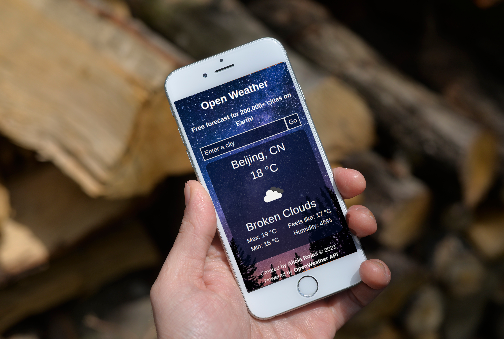

# Weather App ⛅

> A weather forecast site built with JavaScript that uses OpenWeatherMap API to retrieve weather data for any location on Earth!

## Built With

- HTML5
- CSS3
- JavaScript
- Webpack 

## Live Demo

Check out the live version [here](https://aliciapaz.github.io/weather-app/)!

## Getting Started

To get a local copy up and running follow these simple example steps.

### Setup and Install

- Clone this repository using the link above (click on the 'code' button)
- Open a terminal and `cd` to the cloned repository
- Go to `src/weather.js` and replace the value of the variable `key` (line 97) with the API key provided
- Run `npm install`
- Run `npm run build`
- Open `dist/index.html` in a live server in your preferred browser 

### Usage

- Enter the name of a city, choose °C or °F and hit "Go" to check out the forecast
- Click on the toggle button to switch between °C and °F

### Deployment

- Deployed on GitHub Pages

## Authors

👤 **Alicia Rojas**

- GitHub: [@aliciapaz](https://github.com/aliciapaz)
- Twitter: [@_alicia_paz](https://twitter.com/_alicia_paz)
- LinkedIn: [Alicia Rojas](https://www.linkedin.com/in/aliciapazrojas/)

## 🤝 Contributing

Contributions, issues, and feature requests are welcome!

Feel free to check the [issues page](https://github.com/aliciapaz/weather-app/issues).

## Show your support

Give a ⭐️ if you like this project!

## Acknowledgments

- [The Odin Project](https://www.theodinproject.com/paths/full-stack-javascript/courses/javascript/lessons/weather-app)

## 📝 License

This project is [MIT](LICENSE) licensed.
